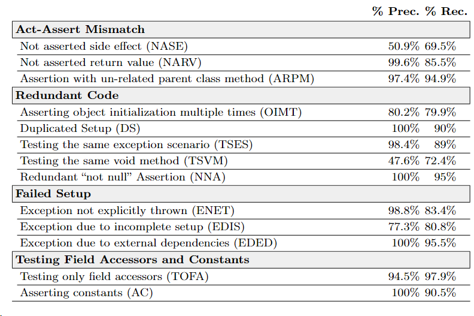

## Smelly - Autogenerated issues detector


<div style="text-align: center;">
    

### Description

Smelly is a tool that detects autogenerated issues in a project. It is able to detect autogenerated issues for the following types:

- Act-Assert Mismatch
    - Not asserted side effect (NASE) 
    - Not asserted return value (NARV)
    - Assertion with un-related parent class method (ARPM)
- Redundant Code
    - Asserting object initialization multiple times (OIMT)
    - Duplicated Setup (DS)
    - Testing the same exception scenario (TSES)
    - Testing the same void method (TSVM)
    - Redundant “not null” Assertion (NNA)
- Failed Setup
    - Exception not explicitly thrown (ENET)
    - Exception due to incomplete setup (EDIS)
    - Exception due to external dependencies (EDED)
- Testing Field Accessors and Constants
    - Testing only field accessors (TOFA)
    - Asserting constants (AC)

### Requirements

In to be able to run the tool, you need to have a copy of the project you want to analyze, and a copy of the test files of the project. 

You will also need a copy of `evosuite-standalone-runtime-1.2.0.jar` and `junit-4.11.jar`.

### Detectors

All current detectors are located in the `src` folder, agrupated by the type of detector they are. If you want to add a new detector, you need to create a new class inside the corresponding folder, and call it from the `MainDetector.java` file.

### How to execute
- The tool needs two main requirements. The original project and the test files of the project in the same distribution as the original project. For example:
    
    ```bash
    .
    ├── source_folder
    |   ├──18_jsecurity
    |   |   ├── pom.xml
    |   |   └── src
    |   |       └── main
    |   |           └── java
    |   |               └── org
    |   |                   └── jsecurity
    └── tests_folder
    |   ├──18_jsecurity
    |   |   ├── evosuite-tests
    |   |   |   └── org
    |   |   |       └── jsecurity

    ```
**You can note that the project `18_jsecurity` is the same in both folders, and the test files are inside the `tests_folder` folder.**


In order to execute the tool, you can test it with the following command:


```bash
java -jar .\target\smelly-1.0-shaded.jar --detectors 0 --evosuitePath "evosuite-standalone-runtime-1.2.0.jar" --junitPath "junit-4.11.jar" --mode 0 --outputFilePath "./example/run_on_one_project" --outputFileName "testeando_parametros" --sourcePath "./example/run_on_one_project/source_folder" --testPath ".\example\run_on_one_project\tests_folder\" -s " "
```

The parameters are the following:

 - `-d,--detectors <arg>`:  Detectors to be executed: 0 for all, 1 only act-assert mismatch, 2 for only redundant code, 3 for only failed setup, 4 for only low contribution.
 - ``-ep,--evosuitePath <arg>``: Path to evosuite standalone-1.2.0.jar file.
 - ``-h,--help``               : Prints help.
 - ``-jp,--junitPath <arg>``   : Path to junit-4.11.jar file.
 - ``-m,--mode <arg>``         : Mode of execution: 0 for evosuite tests, 1 for only JTExpert.
 - ``-ofn,--outputFileName <arg>``: Name of the output file. (The output file is always a .json file)
 - ``-ofp,--outputFilePath <arg>``: Path to output file.
 - ``-r,--resumeAnalisis <arg>``  : Resume analisis from a previous file and don't start from the beginning.
 - ``-sp,--sourcePath <arg>``: Path to folder of java projects.
 - ``-tp,--testPath <arg>``  : Path to folder of test files in their respective project folders.
 - ``-s, --sufix <arg>``     : Sufix of the test folders. Used mostly for precision/recall metrics.

### Current Benchmark



### Important notes
 _Be sure to have created the output folder before executing the tool._
